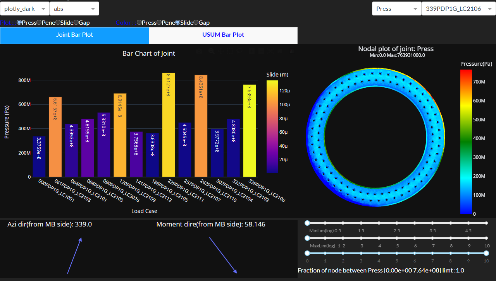

## Dahboard development for Coordinate Transformation: Dash Plotly

- [Coordinate Transformation: Jupyter notebook](https://github.com/iampramodyadav/Dash-plotly/blob/main/Coordinate-Transformation.ipynb)
- [Coordinate Transformation: python](https://github.com/iampramodyadav/Dash-plotly/blob/main/coordinate_mapper.py)
- [Coordinate Transformation: Dashboard](https://github.com/iampramodyadav/Dash-plotly/blob/main/coordinate_mapper_dash.py)
- ### Dashboard-1 layout (Coordinate transform)

- ### Dashboard-2 layout (Joint Post Processing FEA)

